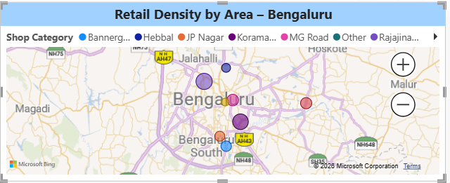
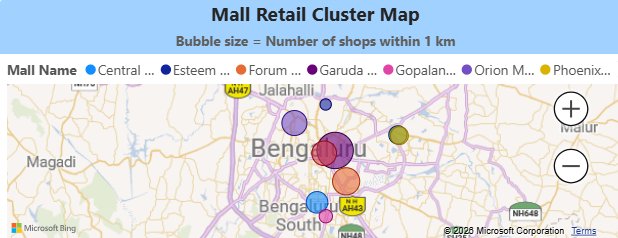

# Geo-spatial-retail-analysis-bangalore
This project analyzes retail store distribution across Bangalore using OpenStreetMap data, population demographics, and CSV datasets.
## 🚀 Project Overview

- **Objective:** Understand retail distribution, identify category dominance, and locate expansion opportunities.  
- **City:** Bangalore, Karnataka, India  
- **Datasets Used:**  
  - Retail stores dataset (India)  
  - Population demographics dataset (Bangalore)  
  - OpenStreetMap retail locations  

- **Tools & Technologies:** Python (Pandas, GeoPandas, Matplotlib, Seaborn), MySQL, Power BI, CSV, OpenStreetMap

- **📂 Folder Description:**
  - */data:* Raw CSV datasets
  - */scripts:* Python Scripts and Jupyter Notebooks
  - */screenshots:* Dashboard Screenshots
  - */powerbi:* Power BI file

  
---

## 🧰 Project Workflow

1. **Data Collection:** Gather retail store locations, population demographics, and OpenStreetMap data.  
2. **Data Cleaning & Transformation:**  
   - Handle missing values and duplicates  
   - Normalize location names and categories  
   - Merge datasets for geo-spatial analysis  
3. **Database Load:**  
   - Store cleaned datasets in **MySQL**  
   - Create tables and run queries for Power BI integration  
4. **Analysis & Visualization:**  
   - Compute **category share percentages**  
   - Map **retail store density** across Bangalore areas  
   - Identify **high-demand and underserved regions**  
5. **Power BI Dashboard:**  
   - Interactive map visualizations  
   - Bar charts for category distribution  
   - Key insights for retail strategy  

---

## 📊 Key Insights

- **Specialty Stores dominate retail (~32%)**  
- **Food & Grocery stores (~25%)** are widely spread in residential areas  
- **Fashion & Apparel (~22%)** concentrated in commercial zones  
- **Home & Lifestyle stores (~5%)** are limited, potential for expansion  
- **Peripheral areas with high population density** show **low retail coverage** — opportunity for new stores

---

## 📈 Dashboard Screenshots

  
*Geospatial distribution of retail stores across Bangalore.*

  
*Retail Shops within the 1 km distance from the Big Mall .*

---

## 🔧 Tools & Libraries

- **Python:** Pandas, GeoPandas, Matplotlib, Seaborn
- **Database:** MySQL
- **Visualization:** Power BI
- **Data Sources:** OpenStreetMap, CSV datasets
